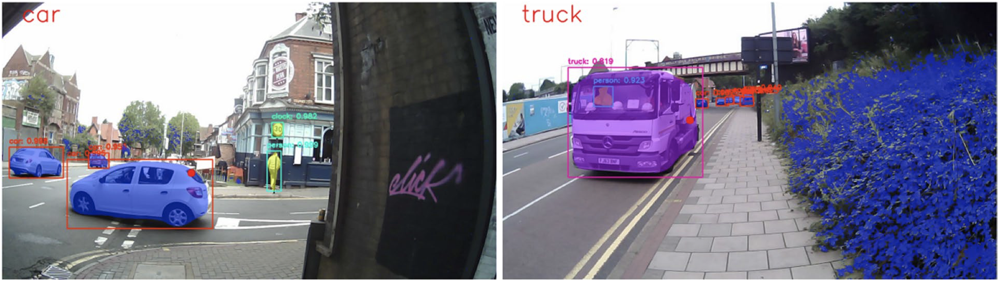
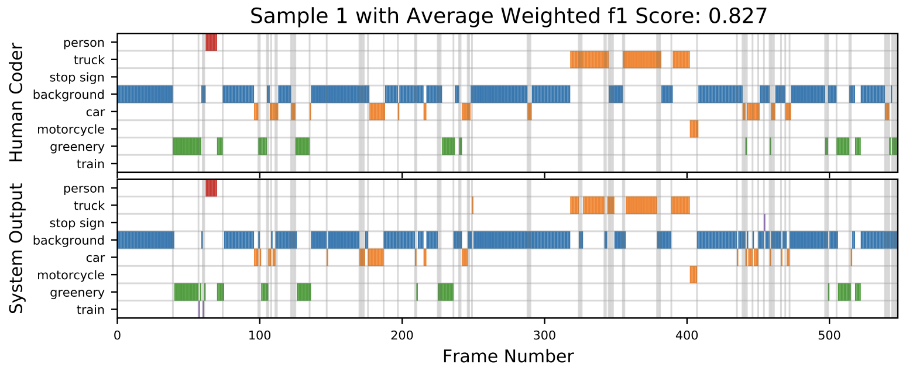

# Deep-SAGA: A Deep-Learning-Based System for Automatic Gaze Annotation from Eye-Tracking Data

This repository accompanies the paper:

> **Deane, O., Toth, E., & Yeo, S.-H. (2022).**  
> *Deep-SAGA: A deep-learning-based system for automatic gaze annotation from eye-tracking data.*  
> *Behavior Research Methods*, 55, 1372–1391.  
> [https://doi.org/10.3758/s13428-022-01833-4](https://doi.org/10.3758/s13428-022-01833-4)

---

## Overview

**Deep-SAGA** is a deep-learning-based system that automatically identifies what a user is looking at during real-world navigation by combining:

- **Scene video** recorded from a head-mounted camera, and  
- **Eye-tracking gaze coordinates** synchronized frame-by-frame.

Using **Mask R-CNN** instance segmentation, the system detects and labels objects appearing in the scene and matches them with the gaze position to determine the object being fixated upon for each frame, thus eliminating the need for manual coding.

---

## Repository Structure

```plaintext
Deep-SAGA/
│
├── src/
│   ├── Gaze_Detection_System.ipynb    # Google Colab notebook for running the system
│   ├── utils.py                        # Utility functions used by the notebook
│   ├── coco_labels.txt                 # Object class labels (MS COCO)
│   └── README_instructions.txt         # Notebook execution details
│
├── System_evaluation/
│   └── ...                             # Raw data comparing system vs. human label accuracy
│
├── user_study_results/
│   └── ...                             # Raw user study data and psychometric responses
│
└── README.md
```
---

## Getting Started

The system is designed to be run in **Google Colab** using GPU acceleration.

### 1. Prerequisites

Ensure you have access to a Google Drive folder (e.g. `Gaze_Detection_System`) containing the following files:

- `your_video_file.mp4`  
- `your_gaze_coordinates.csv`  
- `maskrcnn_predict.py`  
- `coco_labels.txt`  
- `mask_rcnn_coco.h5`

Example files can be downloaded here:  
👉 [Example Data Folder](https://drive.google.com/drive/folders/1OAYbOeE5eIWzM-iwA0Agcg3M9MteN8JQ?usp=sharing)

---

### 2. Running the System

1. Open `src/Gaze_Detection_System.ipynb` in **Google Colab**.  
2. Go to **Runtime > Change runtime type > GPU**.  
3. Edit the variables near the top of the notebook:
   - The **path to your Google Drive folder**  
   - The **names** of your video and gaze data files  
4. Run all notebook cells sequentially.  
5. When prompted, **mount Google Drive** by following the on-screen instructions.

---

### 3. Outputs

After successful execution, the system produces:

| Output Type | Description |
|--------------|-------------|
| **Labelled Video** | A video annotated with bounding boxes and gaze overlays indicating the object being looked at for each frame. |
| **Gaze Object List** | A `.csv` file listing the object gazed upon for each frame. |
| **Summary Statistics** | Average time spent gazing at key object categories (e.g., people, vehicles, greenery). |

#### Example Outputs

| Output | Description |
|---------|-------------|
|  | Example frame showing gaze overlay and object labels. |
|  | Summary statistics visualization of gaze categories. |


---

## Data and Evaluation

### System Evaluation
The **`System_evaluation`** folder contains data comparing system-generated labels with those produced by human annotators. Agreement was assessed using weighted F1-scores (≈0.85 on average), demonstrating high correspondence between the automated and manual annotations.

### User Study
The **`user_study_results`** folder contains the raw data from the case study described in the paper, including:
- Frame-level gaze annotation outputs,
- Participant gaze behavior across natural and urban environments,
- Responses to post-navigation psychometric tests.

---

## Citation

If you use this repository or system in your research, please cite:

```bibtex
@article{Deane2022DeepSAGA,
  title   = {Deep-SAGA: a deep-learning-based system for automatic gaze annotation from eye-tracking data},
  author  = {Deane, Oliver and Toth, Eszter and Yeo, Sang-Hoon},
  journal = {Behavior Research Methods},
  year    = {2022},
  doi     = {10.3758/s13428-022-01833-4}
}
```

## Additional Information

For more details, please refer to the associated publication: https://link.springer.com/article/10.3758/s13428-022-01833-4

A demonstration video: https://drive.google.com/file/d/1MVT0EEoRUVGaxYRiIXMutKeEgmxBU78g/view?usp=sharing

